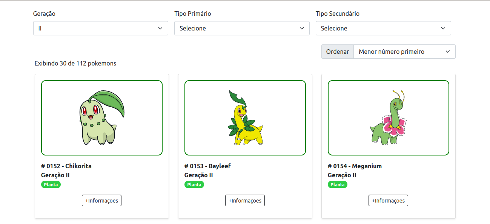

# Pokedex

## Sobre o projeto
O site funciona como uma Pokedéx. Ele exibe as informações dos Pokemons por geração e cada Pokemon é exibido em cards e contém:
  - Imagem
  - Número
  - Nome
  - Tipo(s)

Para obter as informações exibidas foi utilizado a API " [PokéAPI](https://pokeapi.co/).

O site também tem com três filtros:
- Geração
- Tipo Primário
- Tipo Secundário

E as informações também podem ser ordenadas:
- Menor para maior
- Maior para menor
- A-Z
- Z-A

## Tecnologias utilizadas
**Font**
- Bootstrap - versão 5

**Back**
- PHP

**Banco de dados**
MySql

## Telas ##
Utilizando o filtro **Geração** "II"

Utilizando o filtro **Tipo Primário** "Inseto"

Utilizando os filtros **Tipo Primário** "Inseto" e **Tipo Secundário** "Voador"

Utilizando os filtros **Geração** "I" e **Ordenar** "Maior número primeiro"

Utilizando os filtros **Geração** "II" e **Ordenar** "A-Z":

